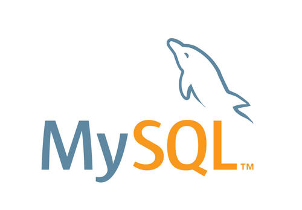

# BookHub——An E-Book store
> SJTU SE128 Design and development of Internet products & SE3353 Architecture of Applications
>
> HW and Project

## Technology stack

Front end: React

Back end: SpringBoot

Database: MySQL

## Change Log

- v1.0 SE128 course project

  finish all the demands in [互联网开发技术大作业要求](doc_assets/互联网应用开发技术大作业要求-2021-new.pdf).

- v1.1 considerable code refactor including

  BackEnd

  1. RESTful API design.
  2. Fine-grained access control using HttpSession.
  3. Better data manipulation using spring JPA.
  4. All lists use pagination to boost the performance.
  5. Using DTO to transfer data in response and request.
  
- v2.0

  1. Using JMS as a message queue to clip the flow.
  2. A chat room based on webSocket.
